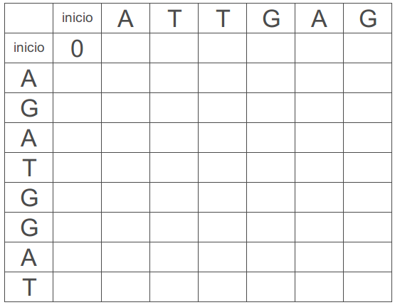
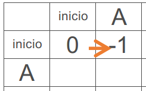
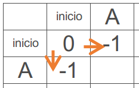
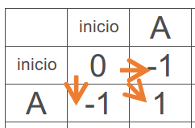
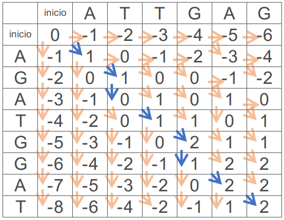
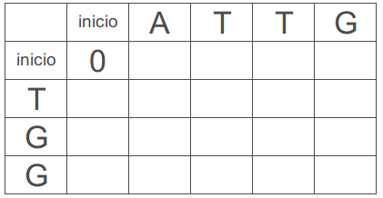
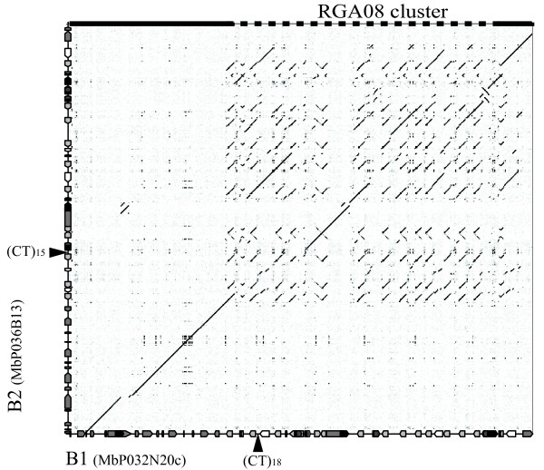
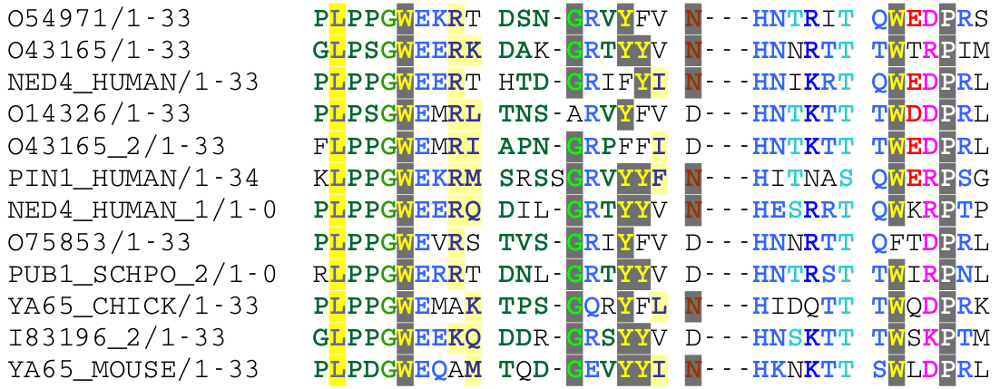

# TP Alineamientos de secuencias de a pares

En este TP vamos a revisar los diferentes algoritmos de alineamiento de secuencia, visualización de los mismos para identificación de patrones y su aplicación.


## Introducción

El alineamiento de secuencias de a pares comprende la asignación uno-a-uno de correspondencias entre los elementos que componen dichas secuencias sin alterar su orden. En dicho proceso tres eventos principales pueden tener lugar:
* **Match (M)**: Cuando los elementos enfrentados son equivalentes.
* **Mismatch (m)**: Cuando los elementos correspondientes son diferentes.
* **Gap (g):** Cuando un elemento de una secuencia no tiene par en la otra y se enfrenta a un espacio, caracterizado por un guión (-).
   * **Gap open:** Cuando se abre un gap.
   * **Gap extend:** Cuando se agregan gaps a continuación de otro gap.

Por ejemplo si alineamos las secuencias AFGIVHKLIVS y AFGIHKIVS un posible resultado sería:

```Bash
AFGIVHKLIVS  
AFGI-HK-IVS
```

La principal función de los lineamientos es establecer una medida de similitud entre las secuencias que participan en el mismo. Para ello es necesario definir un sistema de puntuación que pese cada uno de los eventos que tienen lugar en el. Este puntaje nos permitirá también optimizar el alineamiento utilizando algoritmos que elijan la correspondencia entre secuencias que lo maximicen.

Existen varios algoritmos de alineamiento.
Los **alineamientos globales** (o de Needleman-Wunsch por sus creadores), se realizan apareando todos los elementos de una secuencia con todos los elementos de la otra. Este tipo de alineamientos se utiliza principalmente para comparar dos secuencias que son similares en largo.
Los **alineamientos locales** (o de Smith-Waterman), parean solo parte de las secuencias y son útiles para identificar por ejemplo dominios en comun.
**Alineamientos mixtos**, que combinan los anteriores.

## 1. Dynamic programming

Dado un par de secuencias y un sistema de puntuación se pueden aplicar diversos algoritmos para encontrar el alineamiento que de el mejor puntaje. El algoritmo más popular, utiliza una técnica matemática llamada *dynamic programming*. El mismo consiste en comparar ambas secuencias en una matriz, calculando el costo que tiene llegar a cada una de las celdas (dado el sistema de puntaje preestablecido) y eligiendo la opción más favorable, guardando el puntaje con el que se llega a la celda y el movimiento que lo originó. Una vez la matriz está completa en su totalidad se puede recorrer hacia atrás (desde el extremo inferior derecho al superior izquierdo) para reconstruir el alineamiento.
La principal ventaja de este método es que **siempre encuentra el alineamiento óptimo** entre las secuencias dadas. Sin embargo, puede que existan varios alineamientos que satisfagan esta condición. Otra desventaja es de origen técnica, la exhaustividad con la que el algoritmo realiza la búsqueda hace que su velocidad depende del largo de las secuencias implicadas, lo cual lo hace poco eficiente para búsqueda de similitud de una secuencia contra una base de datos. Para esto existen diferentes adaptaciones del algoritmo que se verán más adelante.

En la práctica: imaginen que quieren alinear las secuencias ATTGAG y AGATGGAT utilizando un scoring de M=1, m=0, g=-1
Para eso ubicamos las secuencias en una matriz, donde cada una de sus dimensiones corresponda a una de las secuencias:



El primer vértice aduiere el valor e cero ya que es con el puntaje con el que iniciamos el alineamiento. A partir de allí completamos calculando para cada vértice el score acumulado de cada posible camino que nos lleve hasta él. Por ejemplo, para alcanzar el siguiente vértice (a la derecha del inicial), solamente se podria acceder por un solo camino:

* Moverse horizontalmente desde el nodo inicial, alineando A con un gap con un score de -1 (g).  

  

```Bash
A  
-  
```

* Lo mismo pasa con el vértice debajo de el nodo de inicio, pero la interpretación es que alineamos la A de la segunda secuencia con un gap en la primera.



```Bash
-  
A  
```

Para completar el nodo que intersecta ambas A, ahí si vamos a encontrarnos que podemos acceder de tres maneras distintas:

* Hacer un movimiento vertical, lo cual nos daria un score de -2 (-1 de la casilla de partida -1 por insertar un gap).

```Bash
A-  
-A  
```

* Hacer un movimiento horizontal, similar al caso anterior, resultando en un score de -2.

```Bash
-A  
A-  
```

* Hacer un movimiento diagonal, lo cual implica alinear ambos caracteres. Como son dos A en cada secuencia, el score seria +1, que es el valor del match.

```Bash
A  
A  
```

Para decidir que valor ubicamos en el vértice simplemente optamos por el que nos dé el mayor score, en este caso 1, y se marca el movimiento que lo produjo: un movimiento diagonal.



Este procedimiento se repite iterativamente calculando los scores para cada vértice e indicando el mejor movimiento. 


Al finalizar la matriz, se puede obtener el mejor alineamiento al reconstruir el camino que nos lleva del extremo inferior derecho al superior izquierdo:



El score final del alineamiento es el score de la ultima celda de la matriz (en este caso +2) y el alineamiento se puede reconstruir siguiendo el camino que hemos establecido, insertando gaps en una u otra secuencia segun si hay un movimiento horizontal o vertical:

```Bash
AT-TG-AG  
AGATGGAT
```

2.1 Utilizando el algoritmo de *dynamic programming* complete la matriz y reconstruya el alineamiento utilizando las secuencias y el scoring del ejemplo:



## 2. Dot-Plots

Los dot-plots son representaciones gráficas que dan un pantallazo sobre la similitud entre dos secuencias. En ellos se pueden identificar patrones que aporten información sobre la relación entre ambas secuencias.
La forma de obtener uno es muy sencilla: se establece una matriz donde cada elemento de una de las secuencias se corresponde con una fila y los de la otra con una columna. Acto seguido se procede a colorear cada celda donde los caracteres correspondientes a fila y columna sean equivalentes.
Por ejemplo:



Nosotros podemos utilizar la herramienta de EMBOSS **dotmatcher** para generar nuestros propios plots. Pueden utilizar la secuencia *HS-ch11-fragment.fasta* que se encuentra en la carpeta *data* para compararla contra sí misma. Esta secuencia es un pequeño fragmento del cromosoma 1 de *Homo sapiens* y la vamos a utilizar únicamente para ver algunos de los patrones que podemos encontrar en un dotplot.

1.1 Genere un dotplot utilizando la secuencia HS-ch11-fragment.fasta contra sí misma.

```Bash
dotmatcher -graph X11 HS-ch1-fragment.fasta HS-ch1-fragment.fasta
```

**Que podemos interpretar de lo que vemos?**

La verdad es que el plot es bastante ruidoso, esto sucede muy a menudo en secuencias genómicas ya que la cantidad de caracteres que componen las secuencias es muy limitada (solo 4) y por ello hay muchas ocurrencias y por lo tanto muchos puntos.
Para limpiar el plot y quedarnos con los matches más significativos podemos jugar con dos parámetros:

* windowsize: Tamaño de ventana
* threshold: Umbral de ocurrencia

Esto quiere decir que solo va a poner un punto cuando un fragmento del largo *windowsize* contenga un score mayor a *threshold*.
Por ejemplo:

```Bash
dotmatcher -graph X11 -windowsize 50 -threshold 20 HS-ch1-fragment.fasta HS-ch1-fragment.fasta
```

Si aumentan estos parámetros pueden ir eliminando fragmentos que corresponden a secciones compartidas más cortas, sin embargo existe una relación de compromiso, utilizar tamaño de ventana y umbral muy grandes nos llevan a perder información por lo que hay que seleccionarlos con cuidado. Aqui hay algunos patrones con los que se pueden encontrar en este tipo de plots:


**a)** Match perfecto.  
**b)** Repeticiones.  
**c)** Palindromo.  
**d)** Repeticiones invertidas.  
**e)** Zonas de baja complejidad (microsatelites).  
**f)** Zonas altamente repetitivas (minisatelites).  
**g)** Secuencias con alta conservación.  
**h)** Inserción o deleción.  


Una vez obtengan un plot que les parezca adecuado. **Que pueden interpretar del mismo?** Identifique patrones.

## 3. Similitud y Homología

Los términos similitud y homología se suelen utilizar como sinónimos por muchos investigadores, sin embargo no es el caso. La similitud es una característica cuantitativa de de un par de secuencias, donde se establece en qué grado estas se parecen (por ejemplo aplicando los algoritmos antes vistos, utilizando un sistema de puntaje). La homología por otro lado es una característica cualitativa, dos secuencias son o no son homólogas, **decir que un par de secuencias tiene N% de homología es incorrecto**. Homología implica específicamente que el par de secuencias estudiadas provienen de un mismo ancestro común. Esta afirmación es completamente hipotética, ya que, salvo en contados casos, no se puede corroborar. Uno puede inferir que este es el caso dado la similitud observada en las secuencias actuales, sin tener acceso a las secuencias ancestrales.
A partir de esta relación entre similitud y homología se puede aplicar para inferir relaciones entre diferentes especies, buscar posibles funciones de una secuencia desconocida, etc.

3.1 Determinar qué especies están más relacionadas utilizando la ribonucleasa pancreática de caballo (Equus caballus), ballena enana (Balaenoptera acutorostrata) y canguro rojo (Macropus rufus).  
    3.1.1 Descargue las secuencias antes mencionadas de la carpeta del TP.  
    3.1.2 Utilice la herramienta de alineamiento global de EMBOSS **needle** (pueden leer el manual para ver que opciones admite) para comparar las tres secuencias.  
    3.1.3 Observe e interprete las salidas obtenidas. Que secuencias son mas similares? Tiene sentido el resultado obtenido?  

```Bash
needle -gapopen 10 -gapextend 1 -asequence *secuencia_1* -bsequence *secuencia_2* -outfile *salida*
```


3.2 Realice el mismo procedimiento pero esta vez para determinar si los mamuts (Mammuthus primigenius) son más cercanos a los elefantes africanos (Loxodonta africana) o asiáticos (Elephas maximus) utilizando la secuencia de la cadena alfa de la hemoglobina.  
    3.2.2 Qué le sugieren los resultados obtenidos?  
    3.2.3 Qué otras explicaciones pueden satisfacer estos resultados?  
    3.2.4 Proponga soluciones para los problemas encontrados.  


## 4. Alineamientos múltiples

Un alineamiento múltiple (MSA) involucra tres o más secuencias biológicas. Debido a que la tarea de alinear múltiples secuencias de largos biológicamente significativos suele ser muy demandante en términos de recursos computacionales y tiempos de ejecución estos requieren metodologías más sofisticadas para llevarse a cabo. Por ello la mayoría de los programas disponibles para realizar MSA utiliza heurísticas en vez de algoritmos de optimización global.

>**Heurística:** es una estrategia que busca resolver un problema más simple cuya solución intersecta con la solución de un problema más complejo. Generalmente esto implica que no es seguro encontrar el mejor resultado pero sí una solución que sea aceptable. Las heurísticas se aplican con frecuencia en computación para poder resolver problemas que por su complejidad serían imposibles de abordar dados los limitados recursos con los que se cuentan.

Dadas las secuencias de aminoácidos de un set de proteínas que se quieren comparar, el MSA muestra los residuos de cada proteína en una fila junto con los gaps que le correspondan de tal manera que todos los residuos "equivalentes" se encuentren en la misma columna. El significado de equivalencia depende por lo general del contexto: para alguien que hace una filogenia puede significar que comparten una ancestro común; un biólogo estructural puede interpretar que son residuos que corresponden a posiciones análogas de un plegado determinado; para el biólogo molecular, residuos equivalentes juegan roles funcionales similares dentro de sus proteínas correspondientes. En cada caso un MSA provee un pantallazo sobre las restricciones evolutivas, estructurales o funcionales que caracterizan un set de proteínas de una manera visual e intuitiva.




Un pipeline típico para realizar un MSA seria:
1. Formular la pregunta que se quiere contestar. Por ej "Que estructura secundaria adopta X region de mi proteína de interés?"
2. Obtener secuencias que puedan contestar a mi pregunta. Por ej. secuencias que estén relacionadas a mi proteína de interés.
3. Utilizar alguno de los programas disponibles para llevar a cabo el MSA. Por ej. EMBOSS
4. Realizar ajustes manuales para corregir posibles errores de los algoritmos de alineamiento.


#### Ejercicios

La gp120 es una proteína que recubre al virus del HIV y facilita su unión e ingreso a la célula que infecta (linfocitos CD4+)
Entre nuestros archivos contamos con un multifasta (gp120.fasta) que contiene 27 secuencias de gp120 de HIV-1, HIV-2 y SIV.
Estas proteínas contienen 9 puentes disulfuro conservados. También es de interés el loop V3, una porción expuesta de la proteína, conocido target de anticuerpos el cual constituye una región hipervariable dada la presión selectiva a la que se ve sometido. Pueden ver la disposicion de los diversos elementos de gp120 en [este esquema](http://www.cbs.dtu.dk/dtucourse/cookbooks/hnielsen/gp120.farve.gif).

4.1 Utilice las herramientas de EMBOSS para realizar un alineamiento múltiple con las secuencias de gp120 (recuerden que para buscar herramientas pueden usar *wossname*)  

4.2 Utilice el comando **showalign** de EMBOSS para obtener una mejor visualización del alineamiento.  

4.3. Observe el alineamiento, como primer control podemos corroborar que las 18 Cisteínas (**C**) estén bien alineadas.  

4.4 Utilice el esquema de gp120 para identificar diversas regiones ya sea conservadas o muy variables (Estructuras, loops, etc.)  
 **Note que las posiciones en el alineamiento cuentan gaps por lo que no se corresponden exactamente con el esquema, utilice las posiciones de las cisteínas conservadas para identificar regiones**
