## Introducción:

Artemis es una herramienta de visualización y anotación de DNA gratuita desarrollada por Kim Rutherford ( Rutherford et al.,2000). Es utilizado rutinariamente para la anotación y el análisis de tanto genomas procariotas como eucariotas, y puede ser utilizado para visualizar datos mapeados de secuenciación de segunda generación. Este programa permite al usuario visualizar archivos de secuencias simples, archivos de EMBL/Genbank y los resultados de análisis de secuencias en un formato gráfico altamente interactivo e intuitivo. Multiples conjuntos/tipos de información pueden ser visualizados dentro de diferentes contextos, por ejemplo, en Artemis se puede inspeccionar motivos de secuencia de DNA, arquitecturas genicas locales (e.g. operones), varias kilobases de un genoma o hasta cromosomas enteros en una única pantalla. Se puede incluso realizar análisis dentro de Artemis guardando la salida para acceder luego.

## 	Objetivos:

El objetivo de este módulo es familiarizarse con las funciones básicas de Artemis empleando una serie de ejercicios. Estos ejemplos fueron desarrollados para atravesar las funciones más utilizadas. Sin embargo, les recomendamos que exploren otras funciones de Artemis que no estan desarrolladas en los ejercicios de este manual. Como siempre, "si no entienden, por favor pregunten!".

### Ejercicio 1: 

#### 1. Iniciar el programa

Para abrir el programa podemos usar la terminal: 

```bash
cd ~/Tools/artemis/
./art
```


Aparecerá una pequeña ventana de inicio. Cargaremos la secuencia del cromosoma de Salmonella typhi, para esto clickeen en **'File'** y luego **'Open'**. Vayan a la carpeta del TP y abran el archivo `S_typhi.dna` seleccionándolo y luego clickeando en **'Open'**. Si todo salió bien se les abrirá una ventana de Artemis. Si no fue así, pidan asistencia.

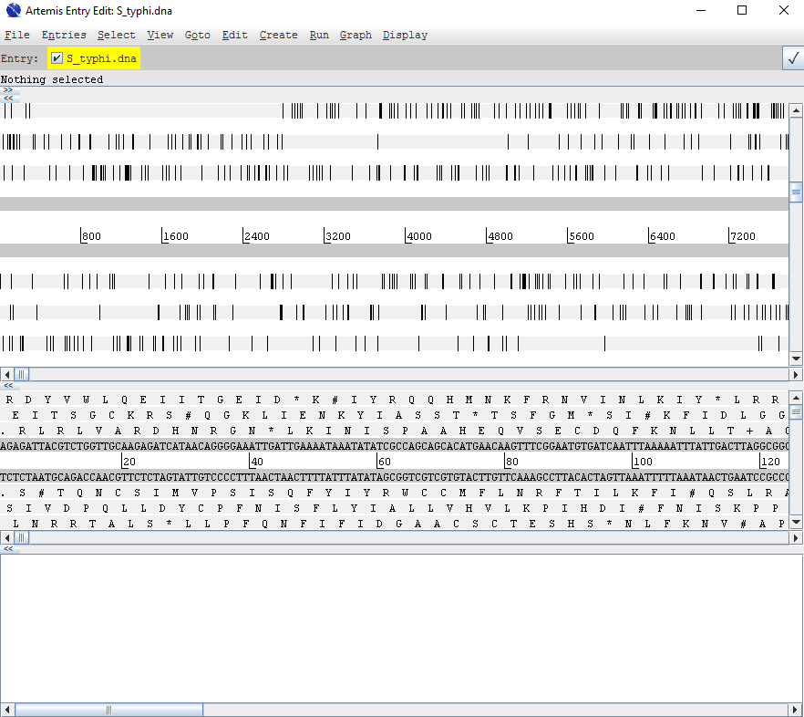

#### 2. Cargando archivos de anotación (*entries*) en Artemis

Ahora cargaremos un archivo de anotación para el cromosoma de *Salmonella typhi*. Esto lo haremos clickeando en **'File'** , **'Read An Entry'** y seleccionando el archivo **'S_typhi.tab'** y luego clickeando en **'Open'**.


#### 3. Vista básica de Artemis

Una vez realizado esto, démosle una mirada a que hay en la ventana ( de arriba hacia abajo):

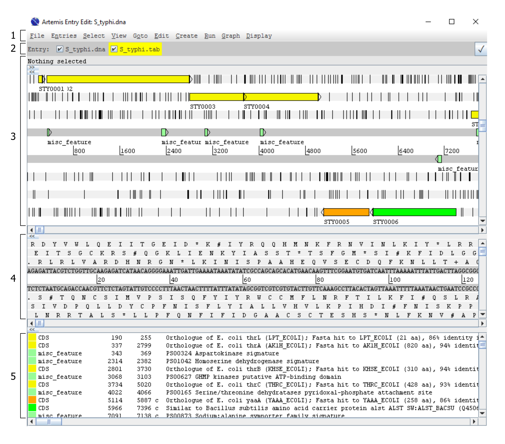

> 1. Menúes desplegables. Después iremos viendo algunas de sus utilidades.
> 2. La siguiente línea muestra que entradas están activas. En nuestro caso estará `S_typhi.dna` y `S_typhi.tab`. Los detalles de los "features" que se encuentran actualmente seleccionados se muestran en el siguiente renglón.
> 3. Este es el panel principal de visualización. Las 2 lineas grises centrales representan la hebra de DNA positiva (arriba) y la negativa (abajo). Arriba y abajo de ellas se encuentran los 3 marcos de lectura en cada sentido, respectivamente. Los codones *stop* en cada marco de lectura son señalados con barras negras verticales. Los genes y otros "features" (e.g. dominios Pfam o Prosite) se muestran como cajas coloreadas.
> 4. Este panel tiene una disposición similar al panel principal pero es un acercamiento que permite observar la secuencia de nucleotidos y de aminoacidos. Hagan doble click sobre un gen en el panel principal y en este observaran un acercamiento del comienzo del gen.Noten que ambos paneles pueden ser desplazados hacia la izquierda o la derecha con el deslizador horizontal (inferior), y acercar o alejar con el deslizador vertical (lateral).
> 5. Este panel lista los "features" presentes, en el orden en que ocurren en el DNA, con el gen seleccionado resaltado.


#### 4. Desplazandose a través de Artemis

Las 3 maneras principales de ir a región o posición que uno quiere en Artemis son: 

- El menu desplegable **Goto**, 
- el **Navigator**, 
- y el **Feature Selector**. 

> El mejor método depende de lo que cada uno este tratando de realizar, conocer cual conviene utilizar en cada caso viene con la práctica.

###### 	4.1 El menu 'Goto'

Las funciones en este menu (ignoren el Navigator por ahora) son atajos para dirigirse a sitios dentro de "features" seleccionados o para saltar al final o principio de la secuencia de DNA. Son muy intuitivos, asi que pruebenlos!

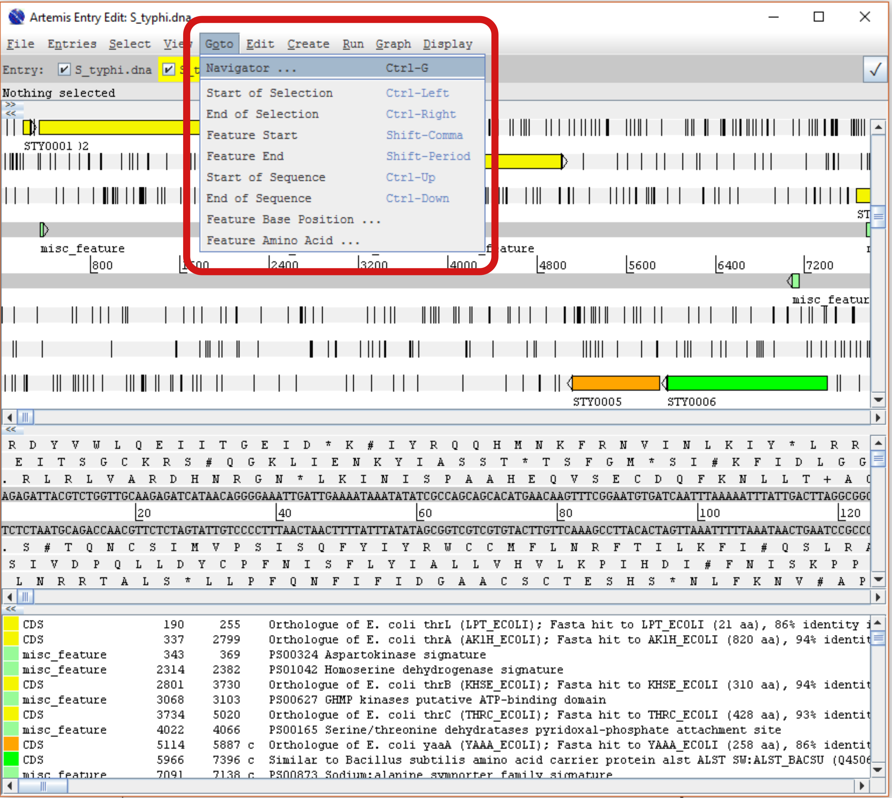

> ###### Tareas sugeridas:
> 1. Alejen el visualizador, marquen una región grande de secuencia clickeando el botón izquierdo del mouse y arrastrando el cursor, luego vayan al principio y al final de la región seleccionada.
> 2. Seleccionen un gen, vayan al principio y al final.
> 3. Vayan al principio y al final de la secuencia del genoma.
> 4. Seleccionen un gen. Dentro de él, vayan a una base y/o aminoácido que quieran.
> 5. Marquen una región, luego desde el menu del click izquierdo, seleccionen 'Zoom to selection'.

###### 	4.2 Navigator

El panel del navigator es muy intuitivo, así que ábranlo (Clic en 'Goto', luego en 'Navigator') y pruébenlo!.

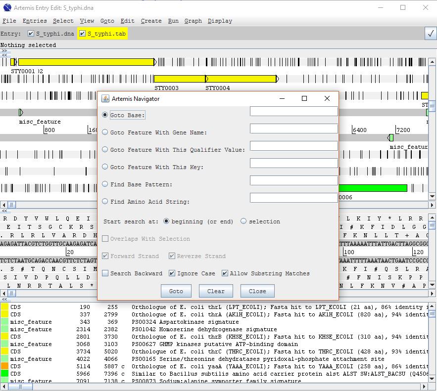

> ###### Sugerencias a donde ir:
> 1. Piensen un número entre 1 y 4809037 y vayan a esa base.
> 2. Su nombre de gen favorito ( puede que no este, en tal caso prueben 'fts').
> 3. Usen 'Goto Feature With This Qualifier Value' para buscar en todos los qualifiers por un término particular. Por ejemplo, usando la palabra 'pseudogene' te llevará al próximo "feature" que contenga esa palabra en cualquiera de sus qualifiers. Noten que repitiendo el clic en el botón 'Goto' los llevará a lo largo de los pseudogenes a medida que se presentan en el cromosoma.
> 4. Para la anotación de los genomas se utiliza un esquema de clasificación funcional mediante números, similar a los términos GO, denominados '*class qualifiers*'. A cada CDS se le asigna un 'class qualifier' de acuerdo a su función. Usen la función 'Goto Feature With This Qualifier value' para buscar CDS que pertenecen a una determinada clase. Algunos que pueden buscar son: 0.0.1 (Conservados en Escherichia coli) ; 1.4.0 (Respuestas protectivas) ; 1.4.1 (Muerte celular) ; 1.4.2 (Detoxificación) ; 1.4.4 ( sensitividad a la radiación) 3.1.0 (Biosintesis de aminoácidos) ; 3.1.01 (Biosíntesis de alanina) ; 3.1.09 (Biosíntesis de glicina).
> 5. Genes de tRNAs. Escriban 'tRNA' en el 'Goto Feature With This Key'
> 6. Secuencias consenso de DNA para la unión de reguladores (reales o inventadas!). Noten que se pueden utilizar valores de bases degeneradas (e.g. R = A o G ; Y = C o T; etc) 
> 7. Secuencias consenso de aminoácidos (reales o inventadas!). Pueden utilizar 'X'. Noten que estas búsquedas se realizan en todos los marcos de lectura independientemente de si realmente codifican aminoácidos o no.

Claramente hay muchos más funciones de Artemis, las cuales no tendremos tiempo de explicar en detalle. Sin embargo ustedes mismos pueden recorrer los menús. Seguramente encuentren que la mayoría de ellos son intuitivos y simples de entender.

###### 	4.3 Feature Selector

Para acceder a este menú hay que ir a "Select" y luego a "Feature Selector ...". Al igual que con el Navigator, esto nos abre una nueva ventana donde podemos elegir los criterios de selección. Cada una de las opciones tiene una cajita asociada a su izquierda que nos permite usar o ignorar cada criterio, pudiéndose realizar cualquier combinación de los mismos.

- **Key**. Desde el menú desplegable se puede elegir que tipo de elemento queremos seleccionar (CDS, tRNA, TMM, etc.). Se lista una gran variedad independientemente si están o no anotados en nuestra secuencia.

- **Qualifier**. Nos permite refinar la búsqueda encontrando un texto determinado en el campo seleccionado (por ej. si elegimos EC_number podemos encontrar las regiones codificantes que pertenezcan a una categoría determinada como hicimos en "Navigator"). Debajo del campo para escribir el texto encontraran 3 cajas más que con opciones para la búsqueda del texto.

- **Up to/At least**. Aquí podemos restringir la búsqueda por cantidad de bases o exones que contiene la secuencia a seleccionar. No guarda mayores misterios.

- **Amino acid motif**. Por último, podemos buscar regiones que contengan ciertos patrones de aminoácidos y si su búsqueda debe llevarse a cabo en la hebra positiva, negativa o ambas.

Al finalizar la elección de criterios pueden apretar "Select" para seleccionar las regiones que cumplan con la búsqueda, o "View" para que nos dé una lista de los hits, con el mismo formato que la que encontramos bajo el panel principal.

### Ejercicio 2: Análisis particulares y globales

#### Analizando información particular:

Por el método de su elección diríjanse a la región localizada entre las bases 2188349 y 2199512 en la secuencia de ADN. Esta región esta *upstream* al gen fbaB, el cual codifica la fructosa bisfosfonato aldolasa. Pueden utilizar el 'Navigator', el 'Feature Selector' o las funciones de 'Goto' discutidas previamente para ir a esta localización. Una vez que estén ahí visualizaremos la información específica disponible:

**Anotación**: Si clickean en un "feature" en particular pueden ver la anotación asociada a él: Seleccionen un "CDS feature" ( o cualquier otro "feature" y clickeen en el menú 'Edit' y seleccionen 'Selected Feature in Editor'. Aparecerá una ventana conteniendo toda la anotación asociada con este CDS.

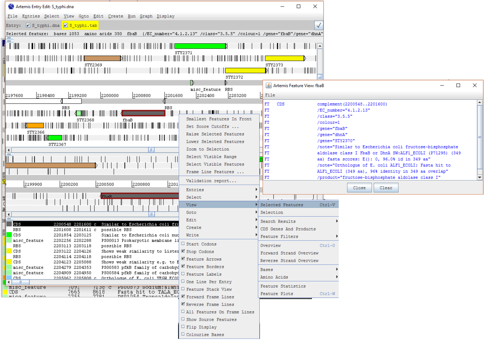

**Visualizando secuencias de aminoácidos:** Clickeen en el menú 'View' y verán varias opciones para visualizar las bases o aminoácidos del "feature" que han seleccionado, en dos formatos, EMBL o FASTA. Esto puede ser muy útil cuando se desea utilizar otros programas que no están integrados en Artemis, e.g. aquellos disponibles en la Web que requieren cortar y pegar la secuencia en ellos.


**Gráficos**: Se pueden desplegar gráficos de características seleccionando un "CDS feature", luego clickeando en 'View' y 'Feature Plots'. La ventana que aparece muestra gráficos prediciendo hidrofobicidad, hidrofilicidad y alfa-hélices para la proteína codificada por el CDS seleccionado.


#### 	Analizando información global:

Además de visualizar al detalle los "features" anotados también se puede observar las características del ADN en toda la región presentada. Esto puede realizarse adicionando diferentes gráficos mostrando distintas características del ADN. Algunos de estos son utilizados para observar el potencial codificante o marcos de lectura dentro del ADN, como el 'GC frame plot', y otros pueden ser utilizados para buscar regiones de ADN adquirido horizontalmente. En el directorio de este módulo encontrarán una tabla de uso de codones, S_typhi.cod, la cual puede ser utilizada para generar un gráfico de uso de codones cargándola mediante la opción 'Add usage plots' dentro del menú 'Graph'.

Clickeen en el menú 'Graph' para ver todos los gráficos disponibles. Tal vez los gráficos más útiles sean 'GC content (%)' , 'GC Deviation' y 'Karlin Signature Difference' (es un gráfico de frecuencia de dinucleótidos). Despliéguenlos!. Para ajustar la suavidad de los gráficos pueden cambiar el tamaño de la ventana sobre la cual los puntos del gráfico son calculados, utilizando el deslizador vertical a la derecha de los mismos.

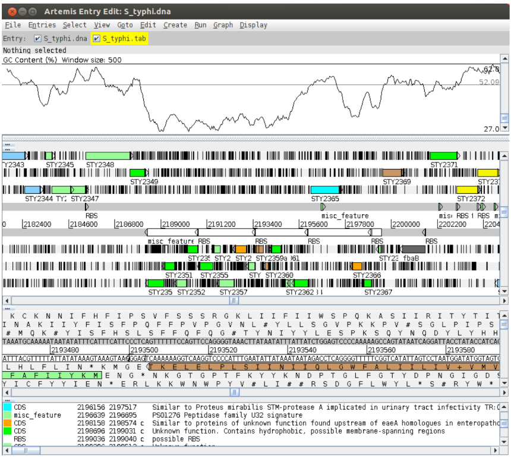

> **Nota**: La información de los gráficos es generada dinámicamente por Artemis y aunque este es un ejercicio relativamente rápido para una pequeña región de ADN, en una vista de genoma completo esto puede demorar un rato, así que, en tal caso, tengan paciencia.

Observen cómo los gráficos muestran una desviación marcada en la región que están visualizando (cerca del gen fbaB). Para apreciar mejor la anomalía de esta región, agranden un poco la región visualizada. **¿Qué les sugiere el contenido inusual de nucleótidos en esta región del ADN?**

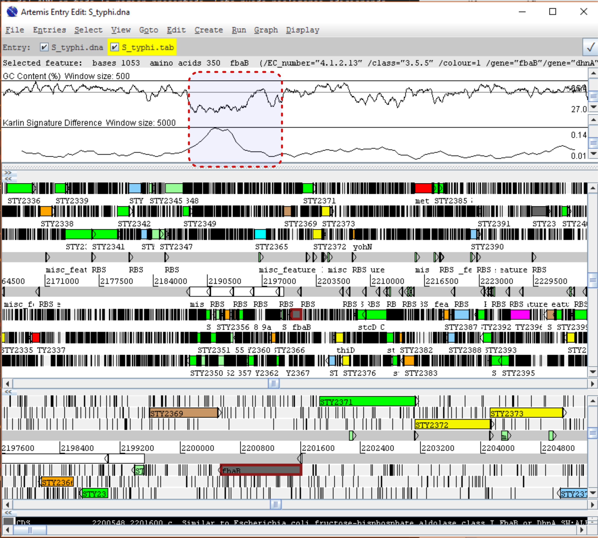

Además de visualizar las características de regiones pequeñas del genoma, también se puede alejar la imagen y observar características del genoma como un todo. Para esto primero tengan en cuenta que alejar la imagen rápidamente con todos los "features" desplegados puede bloquear momentáneamente la computadora. Por lo que para realizar este proceso rápidamente, (1) apaguen los indicadores de codones stop haciendo clic derecho sobre la ventana principal. Aparecerá un menú con la opción de deseleccionar los codones stop. (2) También se debe eliminar temporariamente todo los "features" de anotación. Para realizarlo descliqueen la caja de "S_typhi.tab" en la barra de entrada debajo de la barra de menú.


Otro tip importante es ajustar la escala de los gráficos desplegados antes de alejar la imagen. Esto aumenta el tamaño de ventana sobre el cual un punto en cada gráfico es calculado. Para ajustar el escalado (3) cliqueen con el botón derecho del mouse sobre la ventana de un gráfico en particular. Aparecerá un menú con una serie de valores para los tamaños máximos de ventana, seleccionen 500. Esto deben hacerlo para cada gráfico desplegado.

Ahora están listos para alejar la imagen haciendo clic sobre el deslizador (4) de la ventana principal y arrastrando hacia abajo.


### Ejercicio 3: Anotando el genoma

Ahora vuelvan a seleccionar `S_typhi.tab` en las entradas activas para volver a visualizar las anotaciones. Vayan a la posición 4409511. Buscaremos aquí una región denominada *Salmonella pathogenicity island (SPI)*. En el genoma con el que estamos trabajando la veremos como "*The major Vi antigen pathogenicity island (SPI 7)*"; una región de ~134 kb de largo que contiene un bacteriófago de ~30 kb. 

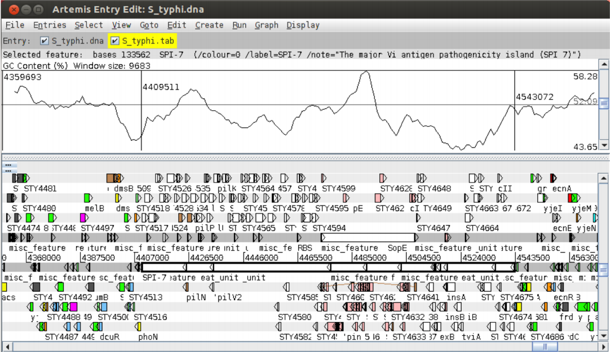

Esta región es un ejemplo más bien clásico de SPI. La definición exacta de qué constituye una isla de patogénesis es, de hecho, bastante diversa; pero las carcterísticas fundamentales comunmente observadas en estas regiones son, según Hacker *et al*., 1997.

1. Normalmente insertas entre dos RNAs estables flanqueantes.
2. Contenidos de G+C atípicos.
3. Codifican, entre otras cosas, para factores de virulencia.
4. Codifican, además, para transposas o integrasas.
5. Se trata de un "cassette" inestable y auto-móvil. 
6. De distribución filogenética limitada.

Para corroborar que efectivamente esta región es un SPI, vamos a extraerla del genoma completo y realizar algunos análisis puntuales. Vamos a apuntar a escribir y guardar un nuevo archivo EMBL, que incluirá nuestras anotaciones para esta región exclusivamente.

Para ello seleccionaremos nuestro presunto SPI y, en la barra de menús desplegables, iremos a `Edit` > `Subsequence (and Features)`. Esto abrirá una nueva ventana (sí, otra más :poop:). A primera vista no parecerá muy distinta a la ventana anterior (la principal, en la que tenemos cargado nuestro genoma), pero si miran un poco mejor notarán que

- Los nombres de las `entries` han cambiado (*no name*)
- Se han re-numerado las bases y ahora todas se relativizan a nuestra selección
- La nueva ventana se extiende desde el principio y hasta el final del presunto SPI, pero no podemos ver nada del genoma completo por fuera de ésta. 

Nótese que en la barra de `entries` de esta nueva ventana, como en la original, también tenemos dos entradas. Si desmarcan una o la otra, notarán que de hecho son las mismas entradas que en la original (contienen la misma información y están en el mismo orden). No obstante, dado que la sub-secuencia ahora es una sesión nueva de Artemis, este comportamiento previene que los originales sean sobre-escritos.

Vamos a guardar estos nuevos archivos con nombres relevantes, para evitar confusiones: Hagan click en `File` > `Save An Entry As` > `New File`. Un nuevo menú nos preguntará cuál de nuestras entries vamos a guardar. 

> En este punto ambas se llaman *no name*, lo cual puede resultar confuso. Lo único que nos ayudará a saber cuál es cuál es el orden (:poop:). 
 
Tomen el primero (desde arriba) y guárdenlo como `spi7.dna`. Repitan el proceso para el segundo y llámenlo `spi7.tab`.

Ahora que hemos guardado podemos empezar a jugar sin miedo a sobreescribir los originales ni a perder nuestro progreso. Lo primero que haremos será identificar los límites del bacteriofago que está inserto en SPI7. Hallar estos límites será equivalente a hallar los sitios de inserción del fago. 

Es importante notar que el `Feature Selector` puede usarse de muchas maneras. En el ejemplo del fago teníamos todo marcado y eso nos facilitó el trabajo, pero también podríamos seleccionar subsets de features de un genoma usando texto o secuencias de aminoácidos.

> Esto significa que, si sabemos qué fago es (o sabemos qué clase de integrasa está involucrada en la integración del mismo), y la secuencia flanqueante del mismo está caracterizada, podríamos buscar nosotros mismos la región sin la necesidad de tenerla pre-anotada. 

Afortunadamente para nosotros, estas regiones ya han sido previamente identificadas y coloreadas en rosa (código de color 12). Para buscarlas podríamos emplear los métodos que ya aprendimos más arriba, pero una búsqueda avanzada por `Feature selector` es más apropiada:

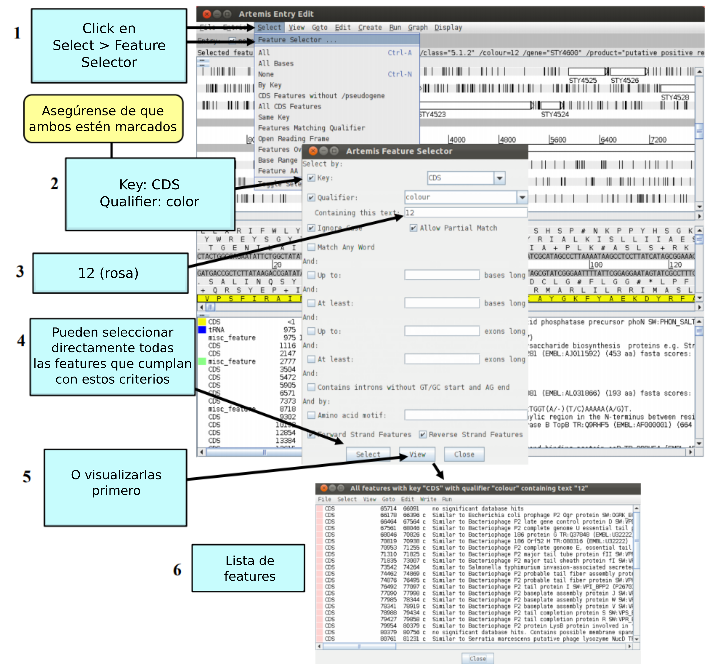

Todos los genes listados en (6) son aquellos cuyas anotaciones cumplen con los criterios seleccionados. Se pueden copiar/cortar/mover a una nueva entry para aislarlos del resto de la información contenida en `spi7.tab`. Para ello, primero vamos a crear una entry vacía: `Create` > `New Entry`. Veremos que aparece una nueva entrada que se llama, como habrán imaginado, `no name`.  

Ahora seleccionamos todos los CDSs mostrados en la lista haciendo click en `Select` > `All`. Todas las features deberían estar seleccionadas. Para copiarlas a otra entry (es decir, a otro archivo) hagah click en `Edit` > `Copy Selected Features To` > `no name` (nuestra entry vacía). Cierren las ventanas de selección y vuelvan a la ventana con la sesión del SPI-7. Podrían renombrar *no name* como *phage.tab*, por ejemplo. Ahora si desmarcan la cajita de spi7.tab en la barra de entries, deberían quedar solo las features asociadas al fago (provistas por el archivo *phage.tab* que acabamos de crear).

Si miran a la ventana con la sesión del SPI7 (y desmarcaron la entry de `spi7.tab`, dejando solo la `phage.tab` marcada), podemos intuir que el profago ocupa una porción discreta de todo el SPI-7. Usualmente, es útil crear una nueva feature de DNA para marcar el genoma a partir de estas observaciones. Para esto, apaguen los *stop codons* y luego usen el botón izquierdo del mouse para generar una selección, arrastrándolo de izquierda a derecha, de lo que consideren ustedes que define al profago. 

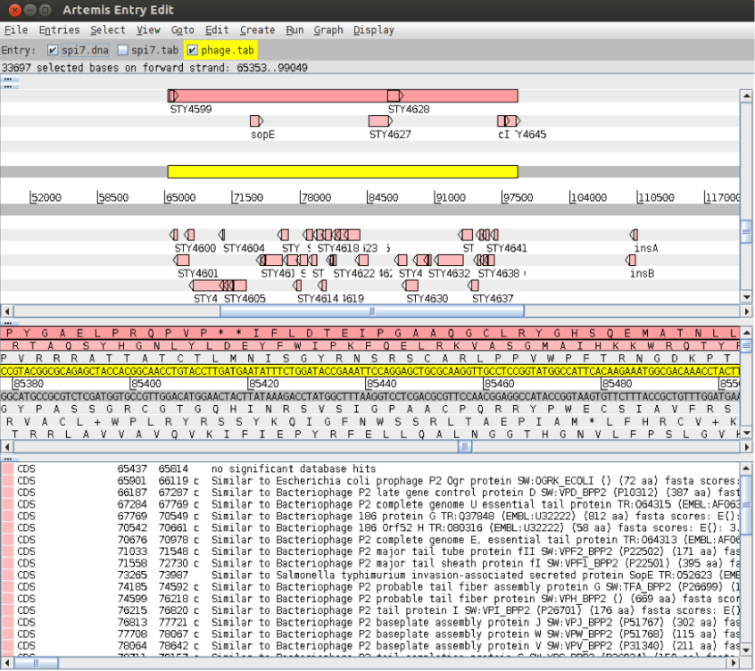

Ahora, con la región seleccionada hagan click en `Create` > `Create Feature from base range` y una ventana para editar la feature aparecerá en pantalla. Por defecto, Artemis asigna *CDS* a la *key* una nueva feature. Esto es incorrecto, ya que lo que buscamos marcar es una región del genoma que no es interesante por su caracter codificante/no-codificante; sino que tiene un fin más bien topográfico. Cambiemos esa key a *misc_feature*. También pueden agregar calificadores haciendo click en `Add Qualifier`. Usando calificadores podemos poner cosas como un `label`, que se usan para mostrar como *nombre* de una secuencia en el panel de visualización principal. 

Ahora que ya han creado nuestra feature, volvamos a encender el `spi7.tab` para ver qué tan bien lo hicieron :tada:. 

Lo último que harán con este ejercicio es escribir sus nuevas anotaciones (`spi7.dna/spi7.tab`) en un archivo tipo EMBL para *submission*; y crear un fichero combinado de anotaciones y secuencia, también en formato EMBL para *submission*. 

Para hacer esto, copien las anotaciones del .tab en el .dna y luego guarden esa entry como `EMBL format`. No se preocupen por los mensajes de error que aparecen. Estos errores tiene que ver con que no todas las features son aceptadas en la base de datos EMBL, y el programa nos advierte que éstas no se van a guardar. La siguiente figura muestra un paso a paso para generar el EMBL.


Si todo salió bien, pueden abrir ahora el EMBL que acaban de guardar y deberían ver algo así

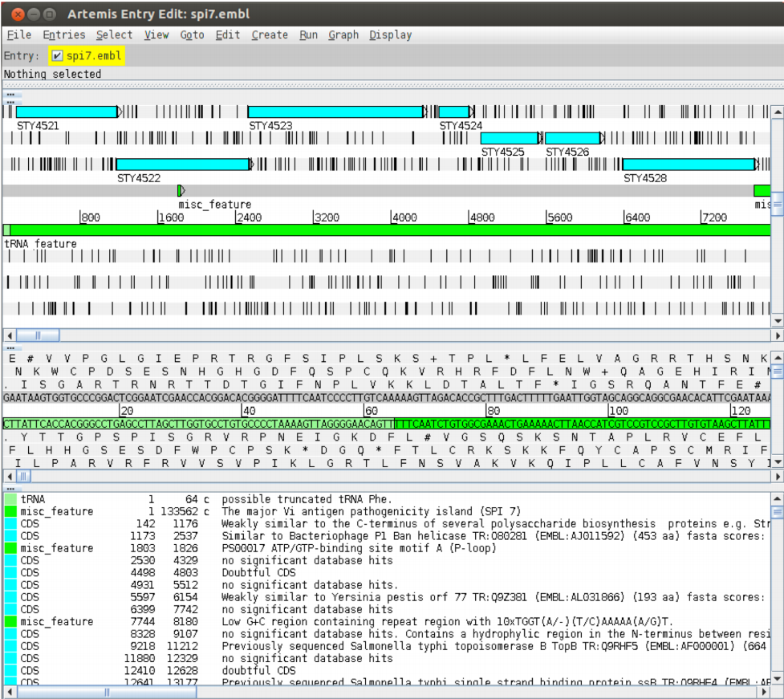

Verán que los colores de la features han cambiado. Esto ocurre porque no todos los calificadores son válidos/acpetados por la base de datos de EMBL, así que éstos no han sido guardados. El qualifier '/colour', por ejemplo, es uno de ellos, por lo que al importar el archivo Artemis los muestra con los colores por defecto. 

Esto implica que cuando descarguen una secuencia en formato EMBL para poner en artemis, siempre tendrán los colores por defecto. No obstante, podrán editar los colores y agregar todos los calificadores que quieran para facilitar su trabajo dentro de Artemis, aunque luego no puedam volver a ser guardados como EMBL. 

### Ejercicio 4: Búsquedas en bases de datos

Este ejercicio los introducirá a las búsquedas en bases de datos a través de la interfaz de Artemis y cómo podemos usar esta función para anotar genes. 

Volvamos a la ventana de *S. typhi*. Vamos a trabajar con el gene *hpcC* (STY1136). Prueben llegar al gen de distintas maneras, así practican. Vamos a analizar el marco de lectura del gene *hpcC*, y para hacerlo vamos a encender todos los codones de *stop* y a cerrar todos los gráficos de %GC que abrimos antes. 

Como ven, nuestro gen esta lleno de codones de *stop*, lo que sugiere que estamos en presencia de *pseudo gen*. Para corregir esta anotación vamos a realizar una búsqueda en base de datos en tres simples pasos:

1. Seleccionamos nuestro **CDS**.
2. Clickeamos en **Run > NCBI Searches**
3. Y mandamos el **blastp**

Este proceso nos presentará una ventan con parámetros customizables para el blast y, haciendo click en *OK*, daremos comienzo al proceso. Demorará algunos segundos y culiminará enviando un *request* al NCBI usando.

Esto nos abrirá una ventana en el navegador en la que podremos seguir el estado del proceso y, eventualmente, visualizar los resultados. 

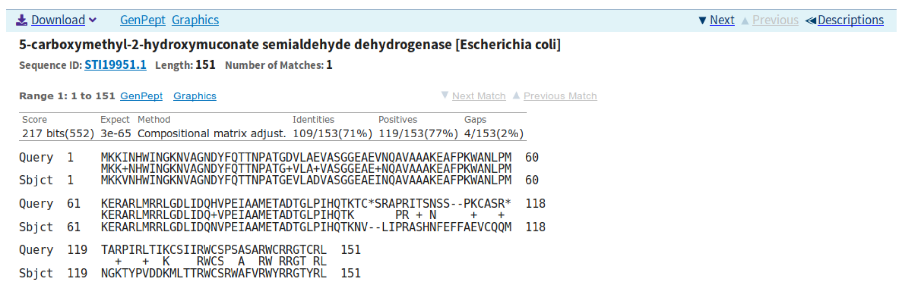

¿Pueden ver dónde está introducido el codón de stop en nuestro gen? Fíjense que el último aminoácido que comparte nuestra secuencia con el mejor hit en la base de datos, es una **K**. A partir de esa **K** vemos que las secuencias empiezan a diverger. Acá hay que ponerse meticulosos: Volvamos a la secuencia query y revisemos las secuencias de aminoácidos propuestas en los tres marcos abiertos de lectura. ¿Qué ven cuando lo ven? :3 


¡El marco de lectura está corrido! *¿Tienen alguna hipótesis de por qué puede pasar esto?*

Bien, ya descubrimos el error. Solo nos queda solucionarlo. Para hacerlo vamos a editar la secuencia codificante. Haremos click izquierdo en aminoácido que consideramos correcto después del último que sabemos que está bien (la K). Luego arrastramos hasta el final del gen para seleccionar toda la secuencia codificante. Con esta selección, crearemos una nueva *feature*: Create > Feature from base range > OK

Adicionalmente tendremos que editar la anotación anterior para acortarla. Para eso selecccionamos el *hpcC* original y clickeamos: Edit > Selected features in editor. En la nueva ventana que se abre vamos a cambiar las posiciones de finalización (en este caso sería la posición del último aminoácido que sabemos que está bien, K).

Finalmente vamos a *mergear* (si alguien sabe un sinónimo de ésto en castellano me avisa) ambas anotaciones como indica la figura:

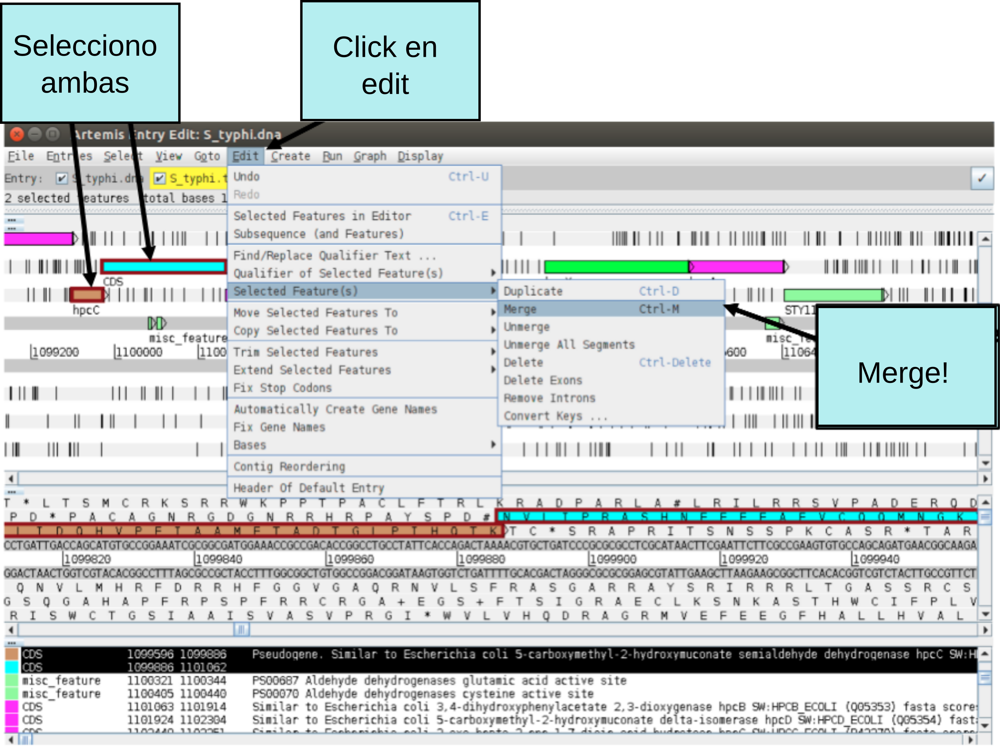

1. Selecciono ambas anotaciones (usando shift)
2. Click en edit
3. Selected features > Merge
4. OK

El resultado va a ser algo así:

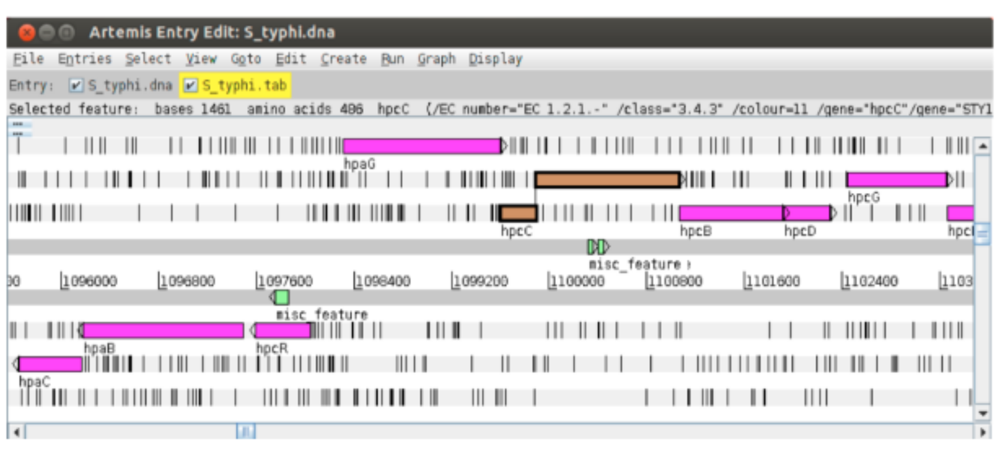

Si se fijan en sus resultados, van a ver que ambas anotaciones está conectadas por una linea; algo que veremos comunmente en genes con intrones... pero *S. tiphy*, como buena bacteria que es, no tiene intrones. 

¿Qué alternativa se les ocurre para arreglar este error?