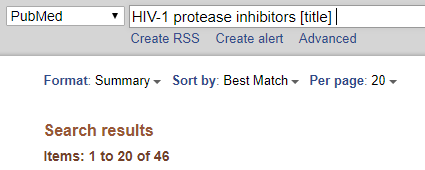
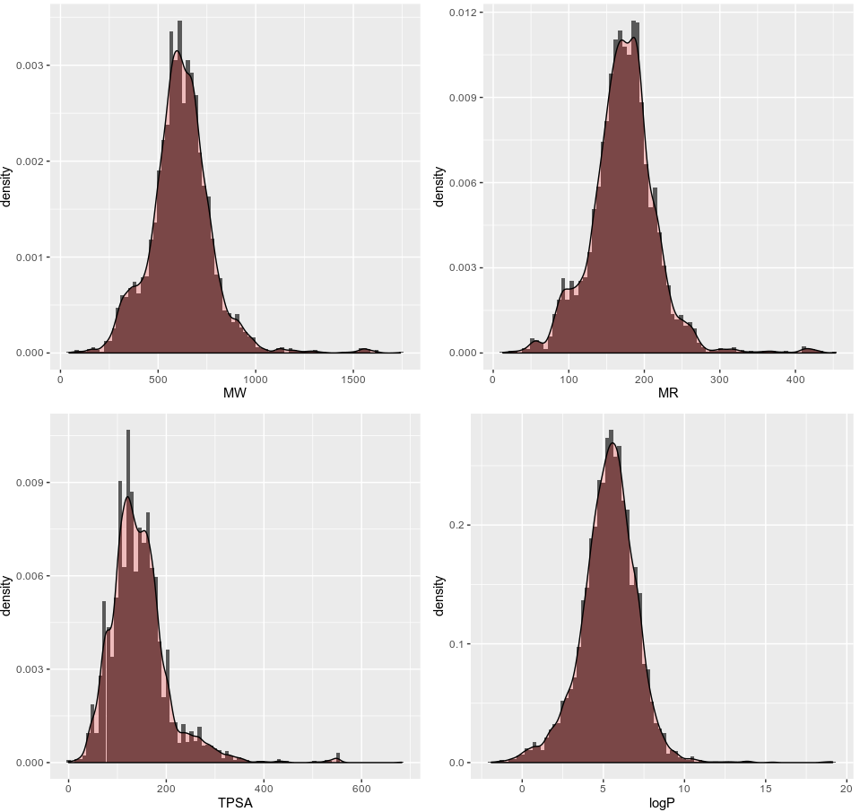
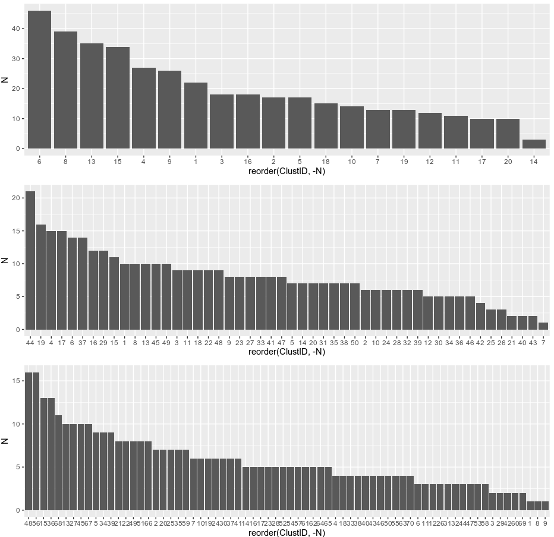
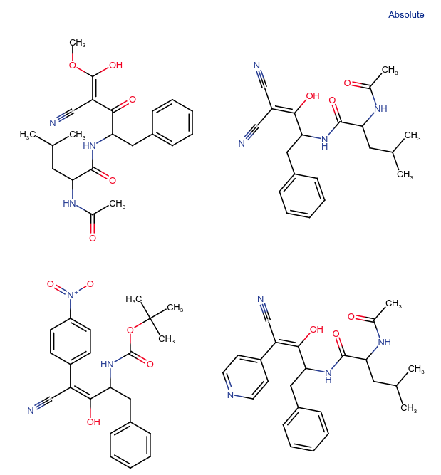

# Quimioinformática

## Introducción

Hemos visto que cada vez es mayor la disponibilidad de fuentes de información con valiosísimos datos biológicos. Aunque un poco rezagadas respecto a otras entidades (como pueden ser las proteínas o las secuencias de ADN/ARN, por ejemplo), las bases de datos moléculas pequeñas o compuestos bioactivos ya han comenzado a disponibilizarse. En la última década, la apertura de estos repositorios (que antes eran un valioso recurso que solo las compañías farmacéuticas podían darse el lujo de construir y mantener), abrió la puerta a multitud de posibilidades para responder una gran cantidad de interrogantes que van desde la química tradicional hasta la biología de las interacciones. 

En el TP de hoy vamos a centrarnos en algunos recursos que nos permiten acceder a información química, vamos a operar con distintas moléculas para describirlas fisicoquímicamente utilizando distintas herramientas quimioinformáticas, y finalmente vamos a intentar aplicar este conocimiento a una gran librería de compuestos que han sido ensayados contra distintas enzimas para medir su capacidad inhibitoria (e intentaremos deducir por qué).

## Encontrar los datos:

Buena parte del trabajo de cualquier bioinformático que se precie es encontrar datos para trabajar. Salvo para aquellos que producen sus propios datos (*y que seguramente hacen wet-lab, fuchi*), el primer paso para contestar cualquier pregunta bioinformática es la obtención de datos relacionados a ésta. 

Su director, el Dr. Dolittle, que trabaja hace varios años en el virus de la inmunodeficiencia bovina (BIV), ha obtenido financiamiento para iniciar un proyecto de **reposicionamiento de drogas **que le permitiría llevar adelante un *screening* in vitro de hasta 10 compuestos. Supongamos que hemos sido asignados la tarea de **hallar inhibidores de la asp-proteasa C3A de ****_virus de inmunodeficiencia humana 1_**** (VIH-1). **Esta enzima, *también llamada Proteasa V1 o HIV-1 Protease *a secas, es una aspartyl proteasa esencial en el ciclo de vida del virus, dado que participa en la maduración de la poliproteína viral que dará lugar a una retrotranscriptasa, una integrasa, una RNAsa H y a sí misma. Esta idea para nada caprichosa (o sí?) surge de una simple hipótesis: **dado que ambos, HIV-1 y BIV pertenecen al mismo grupo taxonómico, los inhibidores confirmados de la proteasa V1 de HIV-1 tendrán altas chances de inhibir la aspartyl proteasa del BIV (que llamaremos BV1)***.*

> ¿Están de acuerdo con la hipótesis de su director?¿Qué podrían hacer para estar seguros de que vale la pena profundizar en ella?

Supongamos que deciden seguir adelante con la propuesta del Dr. Dolittle y buscar los compuestos que nos pidió para comenzar cuanto antes nuestro screening. Lo único que tenemos hasta ahora es la secuencia de un cDNA de la BV1 y el *Uniprot accession number *de su ortólogo en HIV-1 (V1, Q72874)


##### BV1 Sequence cDNA:

    >BV1 cDNA
    ccgcaggtgaccctgtggcagcgcccgctggtgaccattaaaattggcggccagctgaaa
    gaagcgctgctgtgcaccggcgcggatgataccgtgctggaagaaatgagcctgccgggc
    cgctggaaaccgaaaatgattggcggcattggcggctttattaaagtgcgccagtatgat
    cagattctgattgaaatttgcggccataaagcgattggcaccgtgctgattggcccgacc
    ccggtgaacattattggccgcaacctgctgacccagattggctgcaccctgaacttt

    >BV1 Aspartyl Protease, putative
    pqvtlwqrplvtikiggqlkeall**c**tga**dd**tvleemslpgrwkpkmiggiggfikvrqyd
    qilieicghkaigtvligptpvniigrnlltqigctlnf


Para hallar estos inhibidores, una alternativa que ha acompañado a los investigadores desde antaño, es la búsqueda bibliográfica. Es evidente que esto podría llevarnos un tiempo…



### Repositorios quimioinformáticos

… La otra alternativa es utilizar repositorios quimioinformáticos que rápidamente nos permitan hallar y filtrar compuestos de interés. Hay muchas bases de datos con información química. Cada una tiene tiene una función diferente y, aunque comparten cierto tipo de información, han sido diseñadas para responder preguntas distintas. Revisemos, por ejemplo, el Amprenavir. Éste es un inhibidor comercial de la HIV-1 proteasa, indicado para tratamiento de adultos y niños mayores de 4 años en los que la cepa de virus con los que están infectados haya desarrollado resistencia a otras inhibidores de proteasas y podría ser un buen candidato para nuestra lista de potenciales inhibidores de la BV1.  

#### ChEMBL

La base de datos ChEMBL[(1)](https://www.zotero.org/google-docs/?hmWs5S) es un repositorio curado (y muy bien mantenido) de información sobre compuestos bioactivos. En él encontrarán no solo información fisicoquímica o quimioinformática sobre un compuesto, sino también datos acerca de las interacciones conocidas con otros compuestos o proteínas. Con el EMBL-EBI como desarrollador, el repositorio integra con facilidad distintas herramientas bioinformáticas y servicios web del mismo instituto, por lo que es fácil ir, por ejemplo, de la ficha de un compuesto (ChEMBL) a la ficha de una proteína (UniProt). También podremos apreciar si el compuesto ha pasado o no por ensayos clínicos (y si ha a sido aprobado o rechazado en estos, y qué fase), entre otras cosas. 

[https://www.ebi.ac.uk/chembl/compound_report_card/CHEMBL116/](https://www.ebi.ac.uk/chembl/compound_report_card/CHEMBL116/)

#### PubChem

PubChem[(2)](https://www.zotero.org/google-docs/?tnMYUJ) es un repositorio más orientado a químicos. Allí también encontraremos propiedades fisicoquímicas, ensayos biológicos y el estado comercial de un compuesto (si lo tuviera), pero tendremos algunos diferenciales como la hoja de seguridad, los espectros esperados en una espectrometría de masas y potenciales proveedores.

[https://pubchem.ncbi.nlm.nih.gov/compound/Amprenavir](https://pubchem.ncbi.nlm.nih.gov/compound/Amprenavir)

#### DrugBank

En DrugBank[(3)](https://www.zotero.org/google-docs/?b4txcu) hallaremos información que suele ser de mayor interés para la industria farmacéutica, y que tiene que ver con la citotoxicidad y posología del compuesto. En este repositorio solo se encuentra drogas aprobadas (vigentes o retiradas) por la FDA. 

[https://www.drugbank.ca/drugs/DB00701](https://www.drugbank.ca/drugs/DB00701)

#### TDR Targets

TDR Targets ([(4)](https://www.zotero.org/google-docs/?JSzuJ4) es un recurso quimiogenómico especialmente diseñado para el reposicionamiento de drogas hacia patógenos causantes de enfermedades desatendidas. Allí también hallarán información fisicoquímica sobre el compuesto, pero el foco está puesto sobre la predicción de nuevos blancos en estos patógenos y la propuesta de nuevas drogas para éstos. 

[http://tdrtargets.org/drugs/view?mol_id=16501](http://tdrtargets.org/drugs/view?mol_id=16501#targets-similar)

> Naveguen por las fichas del compuesto en cada repositorio y revisen cada una de las secciones que ofrecen ¿Para qué podrían usar esta información?

A esta altura ya habrán notado que con solo buscar el target en ChEMBL pueden obtener una lista de candidatos clínicos para éste. Supongamos que tomaron esta lista para pasarle a su director

<table style="font-size:80%">
  <thead>
    <th>Compuesto</th>
    <th>SMILES</th>
  </head>
  <tr>
    <td>AMPRENAVIR</td>
    <td>CC(C)CN(C[C@@H](O)[C@H](Cc1ccccc1)NC(=O)O[C@H]2CCOC2)S(=O)(=O)c3ccc(N)cc3</td>
  </tr>
  <tr>
    <td>FOSAMPRENAVIR</td>
    <td>CC(C)CN(C[C@@H](OP(=O)(O)O)[C@H](Cc1ccccc1)NC(=O)O[C@H]2CCOC2)S(=O)(=O)c3ccc(N)cc3</td>
  </tr>
  <tr>
    <td>ATAZANAVIR</td>
    <td>COC(=O)N[C@H](C(=O)N[C@@H](Cc1ccccc1)[C@@H](O)CN(Cc2ccc(cc2)c3ccccn3)NC(=O)[C@@H](NC(=O)OC)C(C)(C)C)C(C)(C)C</td>
  </tr>
  <tr>
    <td>DARUNAVIR</td>
    <td>CC(C)CN(C[C@@H](O)[C@H](Cc1ccccc1)NC(=O)O[C@H]2CO[C@H]3OCC[C@@H]23)S(=O)(=O)c4ccc(N)cc4</td>
  </tr>
  <tr>
    <td>RITONAVIR</td>
    <td>CC(C)[C@H](NC(=O)N(C)Cc1csc(n1)C(C)C)C(=O)N[C@H](C[C@H](O)[C@H](Cc2ccccc2)NC(=O)OCc3cncs3)Cc4ccccc4</td>
  </tr>
  <tr>
    <td>INDINAVIR</td>
    <td>CC(C)(C)NC(=O)[C@@H]1CN(Cc2cccnc2)CCN1C[C@@H](O)C[C@@H](Cc3ccccc3)C(=O)N[C@@H]4[C@H](O)Cc5ccccc45</td>
  </tr>
  <tr>
    <td>SAQUINAVIR</td>
    <td>CC(C)(C)NC(=O)[C@@H]1C[C@@H]2CCCC[C@@H]2CN1C[C@@H](O)[C@H](Cc3ccccc3)NC(=O)[C@H](CC(=O)N)NC(=O)c4ccc5ccccc5n4</td>
  </tr>
  <tr>
    <td>TIPRANAVIR</td>
    <td>CCC[C@@]1(CCc2ccccc2)CC(=C([C@H](CC)c3cccc(NS(=O)(=O)c4ccc(cn4)C(F)(F)F)c3)C(=O)O1)O</td>
  </tr>
  <tr>
    <td>NELFINAVIR</td>
    <td>Cc1c(O)cccc1C(=O)N[C@@H](CSc2ccccc2)[C@H](O)CN3C[C@H]4CCCC[C@H]4C[C@H]3C(=O)NC(C)(C)C</td>
  </tr>
  <tr>
    <td>LOPINAVIR
</td>
    <td>CC(C)[C@H](N1CCCNC1=O)C(=O)N[C@H](C[C@H](O)[C@H](Cc2ccccc2)NC(=O)COc3c(C)cccc3C)Cc4ccccc4</td>
  </tr>
</table>

> Intenten visualizar estos compuestos. A ojo, ¿pueden ver alguna característica en común? Usando [MarvinJS](https://marvinjs-demo.chemaxon.com/) copien y peguen los smiles en el editor. 

Unos meses después, su director les comunica por email que ninguno de estos compuestos pudo inhibir satisfactoriamente la BV1 (si desconfiaron del planteo inicial, ya deben saber más o menos a qué podría deberse este fallo, y si no, ¡es hora de corroborarlo!). 

Para expandir un poco el espacio de búsqueda, vamos a salirnos del top-10 de candidatos clínicos y utilizaremos todos los compuestos reportados con evidencia de inhibición de la proteasa V1. 

[link al dataset sdf](#)

Este dataset contiene más de 5000 compuestos y necesitaremos elegir los mejores, para llevárselos a nuestro director y que él decida cuáles vamos a comprar y probar. Esto implica generar una librería de *screening*. En líneas generales vamos a querer:

* Compuestos lo más *druglike* posible.
* Sin compuestos muy similares entre sí.
* Con amplia diversidad de grupos funcionales.

Dado que ahora el número de compuestos que vamos a manejar es muy grande, sería inviable analizarlos objetivamente "a ojo". Por lo que para la construcción y el análisis de esta librería utilizaremos R y algunas librerías bien específicas de este lenguaje para trabajar con compuestos químicos ([ChemmineR](http://www.bioconductor.org/packages/release/bioc/vignettes/ChemmineR/inst/doc/ChemmineR.html)[(5)](https://www.zotero.org/google-docs/?hsbiI7)) y hacer clustering en función de sus características ([fmcsR](http://www.bioconductor.org/packages/devel/bioc/html/fmcsR.html)[(6)](https://www.zotero.org/google-docs/?fhnU6N)). 

A medida que vayamos avanzando en la construcción de nuestra librería, iremos visualizando los cambios en las propiedades fisicoquímicas.

Diríjanse al servidor R de la cursada y abran el script **_quimioinfo.R_****. **Allí encontraremos que las primeras líneas setean el directorio de trabajo y cargan el multi-SDF con todos nuestros compuestos candidatos.


```R
# Cargamos las librerías a utilizar
library(data.table)
library(ChemmineR)
library(ggplot2)
library(plotly)
library(gridExtra)
library(fmcsR)

# Seteamos directorio de trabajo y cargamos dataset
setwd("mi/directorio/de/trabajo")
sdfset <- read.SDFset("all-V1inhibs.sdf")
```

El primer paso para empezar a filtrar es confirmar que todos los compuestos en el dataset han sido cargados correctamente y son válidos para trabajar.

```R
# Removemos compuestos no válidos y duplicados, si los hubiera
valid <- validSDF(sdfset)
sdfset <- sdfset[valid]
apset <- sdf2ap(sdfset)
duplicates <- as.data.table(cmp.duplicated(apset, type=2))[CLSZ_100 > 1]
apdups <- cmp.duplicated(apset, type=1)
nodup.sdfset <- sdfset[which(!apdups)]
nodup.apset<- apset[which(!apdups)]
```
Caractericemos ahora fisicoquímicamente la librería y visualicemos. 

```R
# Caracterización fisicoquímica
nodup.sdfset.data <- as.data.table(propOB(nodup.sdfset))

# Plotear 
plotLibrary <- function(OBData){
    plotear <- list("MW","MR","TPSA","logP")
    plots <- list()
    for(feature in plotear){
        p <- ggplot(OBData[,feature, with=F], aes_string(feature))+
        geom_histogram(aes(y = ..density..), binwidth=density(as.list(OBData[,feature, with=F])[[feature]])$bw) +
        geom_density(fill="red", alpha = 0.2)        
        plots[[feature]] <- p
    }

    do.call("grid.arrange", c(plots, ncol=2))
}

plotLibrary(nodup.sdfset.data)
```

Ejecutando este código deberíamos ver algo así:



Nótese con cuánta facilidad podemos obtener las características fisicoquímicas de grandes volúmenes de datos usando ChemmineR. En el fondo, lo que está haciendo este paquete, en realidad, es usar [OpenBabel](http://openbabel.org/wiki/Main_Page) [(7)](https://www.zotero.org/google-docs/?I4LGMj), un programa quimioinformático con amplia variedad de herramientas de cálculo y análisis de compuestos químicos. Este programa puede utilizarse en windows con una conveniente interfaz gráfica y, en linux, usando la línea de comando. No exploraremos en este práctico el uso de OpenBabel directamente, pero recomendamos tenerlo en cuenta para experimentos quimioinformáticos más pequeños que el que se propone en este TP. 

Hasta aquí solo hemos caracterizado nuestra colección inicial. Aplicaremos ahora nuestros primeros filtros. Es importante entender que los filtros que vamos a aplicar aquí, aunque muy utilizados en el campo del desarrollo de drogas, no ofrecen garantía alguna de que los compuestos seleccionados serán bioactivos. Las características seleccionadas responden a observaciones empíricas sobre lo que está (y funciona) en el mercado farmacéutico pero no hay verdadera evidencia biológica que los soporte. También cabe mencionar que, aunque en este trabajo vamos a estar aplicando algunos conceptos de química medicinal, la idea no es que se las aprendan (ni memoricen, ni se anoten en el machete, ni ni ni), dado que escapa al alcance del TP y la asignatura. 
```R
# Filtramos todo lo que no queremos según reglas de medchem
# Lipinsky
# MW < 500 Da
# logP < 5
# HBD < 5
# HBA < 10
lip <- nodup.sdfset.data[MW<500 & logP <5 & (HBA1 + HBA2) < 10 & HBD <5]

# Ghose Filter
# -0.4 < logP < 5.6
# 40 < MR < 130
# 180 < MW < 480
# TPSA < 140
# 20 < Natoms < 70 *
# Rotable bonds < 10 *
gho <- nodup.sdfset.data[(logP < 5.6 & logP > -0.4) & (MR>40 & MR<130) & (MW>180 & MW<480) & (TPSA < 140)]

# Finalmente juntamos ambas colecciones de compuestos
druglike.sdfset.data <- unique(rbind(lip,gho))

# Y lo exportamos para usar luego
write.table(set.filtrado.data[,cansmi], file="druglike.list",row.names=F,col.names=F,quote=F,sep="\t")
convertFormatFile("SMI","SDF","druglike.list","drugllibrary(data.table)ike.sdf")
```

> ¿Cuántas moléculas quedaron en el dataset luego de utilizar los filtros medchem?¿Cómo cambiaron las características fisicoquímicas de los compuestos en la librería?

Habiendo aplicado el filtro de *drug-likeness* podemos continuar con los filtros de redundancia que son, conceptual y computacionalmente más complejos. Hemos logrado, hasta ahora, una colección de compuestos con características deseables y no muy similares entre sí, pero … ¿cómo sabemos si nuestra librería no tiene uno o más grupos funcionales super-representados? Esto es ¿Cómo identificamos moléculas suficientemente distintas pero con motivos estructurales repetidos?

Revisen, por ejemplo, los compuestos CMP12 y CMP16. ¿Notan alguna similitud?¿Qué tiene en común? 

Nuevamente, podemos recorrer a "a ojo" la librería e ir seleccionando nuestros mejores candidatos. Esta siempre es una opción, pero con grandes librerías (normalmente se trabaja con colecciones incluso más grandes que la que estamos usando), podría llevar muchísimo tiempo. Nuestra mejor opción, en estos casos, es utilizar algoritmos que permitan identificar *grafos* parecidos (o superpuestos), como el MCS* (Maximum common subgraph)*. 
```R
# Como último filtro, vamos a aplicar criterios de MCS para minimizar la redundancia de grupos funcionales
# y así diversificar nuestra librería
# Matrix de distancias MCS <- Esto tarda MUCHO así que lo vamos a cargar directamente 
#d<-sapply(cid(singlet.druglike.sdfset),function(x) fmcsBatch(singlet.druglike.sdfset[x],singlet.druglike.sdfset,au=0, bu=0, matching.mode="aromatic")[,"Overlap_Coefficient"]) 
#write.table(d,file="mcs.distmatrix.tsv",row.names=T,col.names=T,quote=F,sep="\t")
```

Como esto es computacionalmente muy costoso, ya lo hemos calculado y puesto a su disposición en la carpeta del TP. Pueden cargarlo directamente: 
```R
ddf <- as.data.frame(read.csv(file="mcs.distmatrix.tsv",sep="\t"))
```

A continuación aplicaremos lo que ya hemos aprendido sobre *clustering* para agregar los compuestos en nuestra colección y, de esa manera, poder elegir 1 o 2 de cada grupo, reduciendo significativamente el número de candidatos a ensayar. Como saben, establecer el número de *clusters* a generar no es para nada trivial y suele precisar de conocimiento adicional acerca del problema. En este caso, nosotros no tenemos conocimiento alguno que pueda ayudarnos, por lo que haremos un análisis de silueta en busca del número de clusters que, matemáticamente, ofrece la mejor silueta.

Usaremos las librería *clusters* y *factoextra*, que permiten hacer análisis de silueta en un solo llamado: 
```R
# Estimación de número de clusters
k.plot <- fviz_nbclust(ddf, kmeans, method = "silhouette", k.max=100)
which.max(k.plot$data$y) # 70
```


Según este análisis, nuestra mejor opción es 70 aunque, como ven, la variación es prácticamente muy pequeña por encima de 20. Intentemos clusterizar en 20, 50 y 70, para comparar los candidatos que integran cada grupo. 

```R
# Generación de clusters 
k.clusters.70 <- kmeans(ddf,70)$cluster
k.clusters.70.dt<-data.table(CMP=names(k.clusters.70),ClustID=k.clusters.70)
k.clusters.50 <- kmeans(ddf,50)$cluster
k.clusters.50.dt<-data.table(CMP=names(k.clusters.50),ClustID=k.clusters.50)
k.clusters.20 <- kmeans(ddf,20)$cluster
k.clusters.20.dt<-data.table(CMP=names(k.clusters.20),ClustID=k.clusters.20)
```

Fíjense qué pasó con los compuestos "CMP16" y “CMP12” en cada caso. ¿Fueron agrupados en alguna estrategia? 

Ahora veamos cómo son los tamaños que cada cluster
```R
# Veamos el tamaño de los clusters
k.clusters.20.size <- unique(k.clusters.20.dt[,N:=.N,by="ClustID"][order(-N)][,.(ClustID,N)])
k.clusters.50.size <- unique(k.clusters.50.dt[,N:=.N,by="ClustID"][order(-N)][,.(ClustID,N)])
k.clusters.70.size <- unique(k.clusters.70.dt[,N:=.N,by="ClustID"][order(-N)][,.(ClustID,N)])
p20<-ggplot(k.clusters.20.size,aes(x=reorder(ClustID,-N),y=N))+geom_bar(stat="Identity")
p50<-ggplot(k.clusters.50.size,aes(x=reorder(ClustID,-N),y=N))+geom_bar(stat="Identity")
p70<-ggplot(k.clusters.70.size,aes(x=reorder(ClustID,-N),y=N))+geom_bar(stat="Identity")
grid.arrange(p20,p50,p70,nrow=3)
```

Independientemente de qué cluster es más grande o más pequeño dentro de cada estrategia, ¿qué podría decirse del tamaño de clusters a medida que aumentamos el k? ¿Les parece razonable? Intenten visualizar los compuestos que integran clusters pequeños y clusters grandes en cada una de las estrategias de clustering. Pueden partir de la segmentación más grande (k=70), elegir algunos compuestos y ver cómo se agrupan éstos en las demás segmentaciones. 



Finalmente su director, que ya está ansioso por gastar su dinero bien habido, les dice que elijan 50 compuestos (y que lo quiere para ayer). Sin mucho tiempo para seguir analizando, deciden utilizar la segmentación de k = 50, y tomar un compuesto de cada grupo para armar la librería final.

```R
# Dado que vamos a agarrar uno al azar, setamos una semilla para que el resultado sea reproducible
set.seed(1)
libreria<-k.clusters.50.dt[,sample(CMP,1),by = ClustID][order(ClustID)]
singlet.druglike.sdfset.final <- singlet.druglike.sdfset[libreria[,V1]]
SDFDataTable(singlet.druglike.sdfset.final)
```

Su director está muy conforme con la librería propuesta y adquirió todos los compuestos. Después de algunos duros meses de trabajo, solo uno de los compuestos, CMP439, mostró capacidad inhibitoria suficiente de la BV1 en ensayos *in vitro*. En un intento desesperado por salvar su tesis, le proponen a su director buscar en la colección original algunos compuestos relacionados a CMP439.

```R
clust <- k.clusters.50.dt[CMP=="CMP439"][,ClustID]
libreria.min <- unique(k.clusters.50.dt[ClustID==clust][,CMP])
singlet.druglike.sdfset.final.min<-singlet.druglike.sdfset[libreria.min]SDFDataTable(singlet.druglike.sdfset.final.min)
```

Aunque solo algunos de estos nuevos compuestos tiene capacidad inhibitoria: CMP448, CMP439, CMP326 y CMP209, este enriquecimiento sugiere que hay algo inherente a este grupo de moléculas que les confiere actividad. ¿Qué puede ser?



